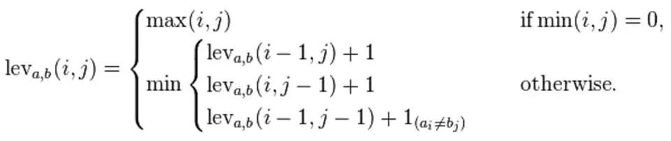

## Moogle!

> Proyecto de Programación I. Facultad de Matemática y Computación. Universidad de La Habana. Curso 2021.

>Raydel E. Reuco García C113

En este proyecto he implementado algunos de los objetivos propuestos,agregando nuevas clases y elementos para poder llegar al resultado esperado. 

### Funcionalidades implementadas en el proyecto:

-Agregada una clase para guardar y ordenar la query junto con la dirección de los documentos sobre los cuales se realizará la busqueda(SearchQuery).

-Mediante otra clase FileContent se guarda el nombre del archivo con su contenido ya formateado junto a los operadores(!,^,~,*) y ejecutar sus propósitos sobre la clase de archivos antes mencionada,afectando si el documento tiene o no que estar , tanco como su score a tener en cuenta a la hora de ordenar.

-Con la implementacion de el algoritmo TF(Text Frecuency)-IDF(Inverse Document Frecuency) , o sea la frecuencia de ocurrencia de la frase introducida en la 
colección de elementos analizada , determinando como medida númerica cuan relevante es una palabra para un documento en dicha colección , este valor aumenta 
proporcionalmente respecto al número de veces que la palabra aparece en el documento , pero esto se compensa por la frecuencia de esa palabra en la colección de 
documentos destacando de esa forma el hecho de que algunas palabras son mas comunes que otras y existiendo varias formas de calcular su valor numérico usando en 
mi implementación una clase Vector con un array de esta clase que incluye una palabra con todos sus valores TF*IDF de cada documento,teniendo en cuenta con esto 
la implementación abstracta de una matriz tomando todas las palabras como las filas y todos los documentos como las columnas , luego se realiza la misma 
operacion para el query y se crean vectores de esta misma forma para cada una de sus palabras.

-Seguido de esto pasa a otro metodo el cual se encarga de tomando los vectores antes formados calcular la similitud entre ellos y el query mediante el cálculo del coseno entre cada unos de esos vectores y el véctor query, para luego asignarle ese valor de similitud a cada uno de sus documentos y devolverlos.

#### A continuación dejo una explicación de este algoritmo extraída de [Information retrieval document search using vector space model](https://www.datasciencecentral.com/information-retrieval-document-search-using-vector-space-model-in/)
##### Similarity Measures: cosine similarity

    Mathematically, closeness between two vectors is calculated by calculating the cosine angle between two vectors. In similarlines, we can calculate cosine angle between each document vector and the query vector to find its closeness. To findrelevant document to the query term , we may calculate the similarity score between each document vector and the query termvector by applying cosine similarity . Finally, whichever documents having high similarity scores will be considered asrelevant documents to the query term.
    When we plot the term document matrix, each document vector represents a point in the vector space. In the below examplequery, Document 1 and Document 2 represent 3 points in the vector space. We can now compare the query with each of thedocument by calculating the cosine angle between them. 

-Despúes se guardan todos estos valores en un array , se ordena y luego se iguala con cada uno de los valores para devolverlos en otro array ya ordenados.

-También esta la sugerencia la cual si hay una palabra de query que no esta en el documento se usa el algoritmo de Levenshtein Distance , el cual calcula el 
número minimo de operaciones necesarias para transformar un string o cadena de caracteres en otro para calcular las palabras mas próximas en los documentos y 
devolvérsela al usuario.

#### A continuación dejo una explicación de este algoritmo extraída de [The Levenshtein Algorithm](https://www.cuelogic.com/blog/the-levenshtein-algorithm)

    Mathematically, the Levenshtein distance between two strings a, b (of length |a| and |b| respectively) is given by leva,b(a|,|b|) where:
    
    where 1(ai≠bi) is the indicator function equal to 0 when ai≠bi and equal to 1 otherwise, and leva, b(i,j) is the distancebetween the first i characters of a and the first j characters of b.
    Note that the first element in the minimum corresponds to deletion (from a to b), the second to insertion and the third tomatch or mismatch, depending on whether the respective symbols are the same.

-Por último se analiza en los documentos devueltos la ubicación de las palabras del query y se añaden al snippet dando una breve información del contenido de los mismos.

**Bibliografía empleada**
-Información de wikipedia y varios sitios web.