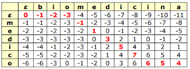

## Moogle!

> Proyecto de Programación I. Facultad de Matemática y Computación. Universidad de La Habana. Curso 2021.
> Raydel E. Reuco García C113

En este proyecto he implementado algunos de los objetivos propuestos,agregando nuevas clases y elementos para poder llegar al resultado esperado. 

### Funcionalidades implementadas en el proyecto:

- Agregada una clase para guardar y ordenar la query junto con la dirección de los documentos sobre los cuales se realizará la busqueda(SearchQuery).

- Mediante otra clase FileContent se guarda el nombre del archivo con su contenido ya formateado junto a los operadores(!,^,~,*) y ejecutar sus propósitos sobre la clase de archivos antes mencionada,afectando si el documento tiene o no que estar , tanco como su score a tener en cuenta a la hora de ordenar.

- Con la implementacion de el algoritmo TF(Text Frecuency)-IDF(Inverse Document Frecuency) , o sea la frecuencia de ocurrencia de la frase introducida en la 
colección de elementos analizada , determinando como medida númerica cuan relevante es una palabra para un documento en dicha colección , este valor aumenta 
proporcionalmente respecto al número de veces que la palabra aparece en el documento , pero esto se compensa por la frecuencia de esa palabra en la colección de 
documentos destacando de esa forma el hecho de que algunas palabras son mas comunes que otras y existiendo varias formas de calcular su valor numérico usando en 
mi implementación una clase Vector con un array de esta clase que incluye una palabra con todos sus valores TF*IDF de cada documento,teniendo en cuenta con esto 
la implementación abstracta de una matriz tomando todas las palabras como las filas y todos los documentos como las columnas , luego se realiza la misma 
operacion para el query y se crean vectores de esta misma forma para cada una de sus palabras.

- Seguido de esto pasa a otro metodo el cual se encarga de tomando los vectores antes formados calcular la similitud entre ellos y el query mediante el cálculo del coseno entre cada unos de esos vectores y el véctor query, para luego asignarle ese valor de similitud a cada uno de sus documentos y devolverlos.

##### Simulitud del coseno:

> Matemáticamente, la cercanía entre dos vectores se obtiene calculando el ángulo del coseno entre dos vectores. De manera similar, se puede calcular el ángulo del coseno entre cada vector de documento y el vector de consulta para encontrar su cercanía. Para encontrar el documento relevante para el término de consulta, podemos calcular la puntuación de similitud entre cada vector de documento y el vector de término de consulta aplicando la similitud del coseno. Finalmente, aquellos documentos que tengan puntajes de similitud altos se considerarán documentos relevantes para el término de consulta.
>Cuando graficamos el término matriz de documento, cada vector de documento representa un punto en el espacio vectorial. En la siguiente consulta de ejemplo, el Documento 1 y el Documento 2 representan 3 puntos en el espacio vectorial. Ahora podemos comparar la consulta con cada uno de los documentos calculando el ángulo del coseno entre ellos. 

#### A continuación dejo una explicación más extensa de este algoritmo [Information retrieval document search using vector space model](https://www.datasciencecentral.com/information-retrieval-document-search-using-vector-space-model-in/)

- Despúes se guardan todos estos valores en un array , se ordena y luego se iguala con cada uno de los valores para devolverlos en otro array ya ordenados.

- También esta la sugerencia la cual si hay una palabra de query que no esta en el documento se usa el algoritmo de Levenshtein Distance , el cual calcula el 
número minimo de operaciones necesarias para transformar un string o cadena de caracteres en otro para calcular las palabras mas próximas en los documentos y 
devolvérsela al usuario.

##### Distancia de Levenshtein

> La distancia de Levenshtein entre dos cadenas a, b es la cantidad mínima de cambios elementales en la cadena "a" para que se convierta en la "b" donde los cambios pueden ser una inserción, eliminación o la sustitución de un carácter

> Por ejemplo:  
>-"pelo" y "perro" (inserción de "r" entre "l" y "o" y sustitución de "l" por "r")  
>-"casa" y "caza" (sustitución de "s" por "z")  
>-"manta" y "matar" (eliminación de "n" e inserción de "r")  

- Por último se analiza en los documentos devueltos la ubicación de las palabras del query y se añaden al snippet dando una breve información del contenido de los mismos.

#### A continuación dejo una explicación mas extensa de este algoritmo [The Levenshtein Algorithm](https://www.cuelogic.com/blog/the-levenshtein-algorithm)

**Bibliografía empleada**

- Información de wikipedia y varios sitios web.